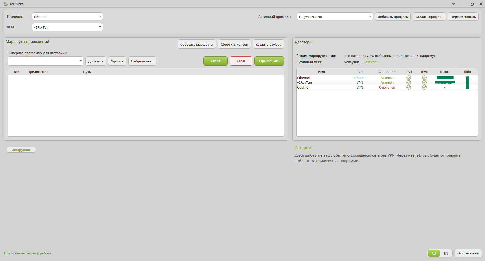

# reDivert

**reDivert** — это Windows-утилита для split tunneling в VPN-конфигурациях, где используется реальный туннельный сетевой адаптер.

Программа позволяет сохранить VPN для всей системы, а выбранным приложениям дать прямой доступ в сеть через обычное домашнее подключение.

## Для чего нужен reDivert

reDivert подходит для сценария, когда VPN должен оставаться включённым для всего компьютера, но отдельные программы должны работать через обычное локальное соединение.

Это может быть полезно в тех случаях, когда часть приложений должна идти через VPN, а часть — напрямую, без ручного переключения всей системы.

## Как это работает

Пользователь выбирает обычный домашний адаптер, затем активный VPN-адаптер, добавляет нужные приложения и применяет настройки. После этого выбранные программы работают напрямую, а остальная система продолжает использовать VPN.

## Ключевые особенности

- split tunneling для выбранных приложений;
- VPN остаётся активным для всей системы по умолчанию;
- поддержка русского и английского языка интерфейса;
- работа в VPN-сценариях с реальным туннельным адаптером Windows;
- простой и понятный интерфейс без лишней перегрузки.

## Поддерживаемые VPN-сценарии

reDivert рассчитан на VPN-окружения, где создаётся реальный сетевой туннельный адаптер Windows.

Подтверждённые сценарии:

- RedVPN
- Outline
- v2RayTun в режиме Sing-box + Tunnel

## Важные замечания

- для нормальной работы требуются права администратора;
- программа рассчитана на поддерживаемые VPN-сценарии с туннельным адаптером;
- содержимое трафика не логируется;
- reDivert является локальной утилитой маршрутизации и не предназначен для анализа содержимого трафика, скрытого перехвата или схожих сценариев.

## Сторонний компонент

В проекте reDivert используется **WinDivert** как сторонний сетевой компонент.

Отдельная благодарность автору **basil** и проекту **WinDivert** за технологическую основу, которая сделала возможной реализацию данной схемы маршрутизации.

Подробности указаны в файлах `README_Technical.md`, `THIRD_PARTY_NOTICES.txt` и в приложенных текстах сторонних лицензий.

## Техническая информация

Подробная техническая информация и инструкция по использованию: [README_Technical.md](README_Technical.md)

---

<b>English version (click to open)</b>

 

English documentation and usage guide: [README_EN.md](README_EN.md)

